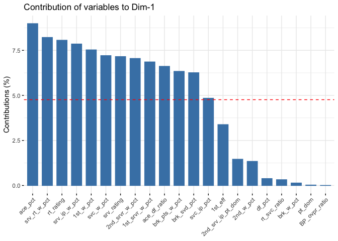
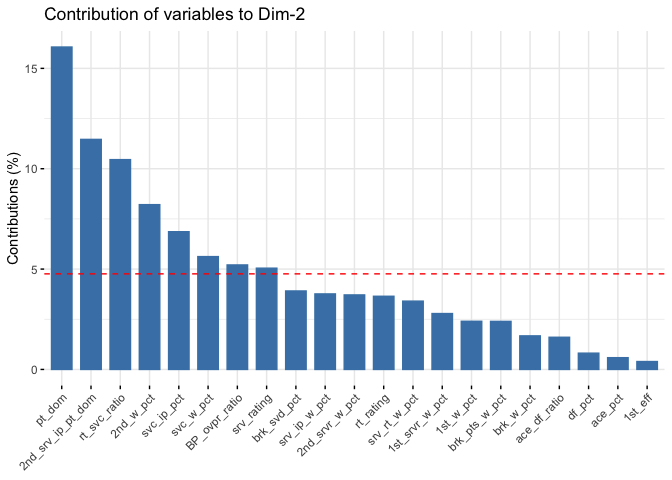
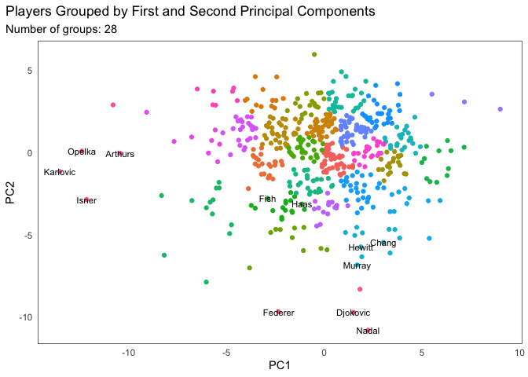

README
================
Nolan Choy

# Tennis Win Probability Prediction

## File Contents:

**replace\_player\_file:** Converts .csv to .xlsx and changes file name
to the player name for easier processing (only used for data downloaded
from ultimatetennisstatistics.com)  
**pca\_cluster:** Script to generate PCA coordinates and K-means
clusters, outputs tennis\_clusters.xlsx file  
**tennis\_script:** Pre-processes data to generate relevant variables
such as opponent cluster  
**player\_modelling:** Calculates a Brier Score metric for logistic
regression, average win rate, and elo-score models for a single player  
**summarize:** Reports the average Brier Score for the above models for
all players (or for players with more than x matches) to compare model
accuracy

## The Data

Match and player statistics data was downloaded from
ultimatetennisstatistics.com. Match data consists of data from 558
players and over 18,800 total matches. Player statistics data tracks 551
players with over 25 variables to measure historical performance.

## Methods

### PCA

Because of the high dimensionality of the original data, I needed a
method to reduce the amount of variables measuring similar things. I
employed PCA to retain the most significant variables and cutting less
explanatory features from the model. This will be helpful later on when
clustering to increase variability in the first two principal components

Here is a breakdown of variable contribution to the first and second
principal components

<!-- --><!-- -->

Dropped variables include BP\_svd\_ovpr\_ratio, BP\_conv\_ovpr\_ratio,
df2s\_pct, and 1st\_pct

### K-means Clustering:

<!-- -->

PCA component coordinates help generate the map with which to cluster
tennis players. Players are divided into 28 clusters based on their
play-style (variability in the first and second PCs). Several players
are highlighted to take note of.

**Cluster 10** includes Opelka, Arthurs, Karlovic, and Isner, some of
the biggest servers.  
**Cluster 18** includes Haas and Fish, known as exceptional volleyers.  
**Cluster 23** includes Murray, Hewitt, and Chang, notorious
counterpunching baseliners.  
**Cluster 9** includes Federer, Djokovic, and Nadal, known as the Big 3
in tennis.

### Win Probability Generation

#### Modelling

Win Probability, calculated from a *logistic regression* model, was
compared against win probabilities generated from elo-ratings and
historical win probability.

The univariate logistic regression was calculated using a player
opponent’s cluster as a factor. Without any other parameters, the win
probability predicted from the logistic regression is equal to the win
rate against clusters.

Elo-rating win probability model follows the win probability equation
assuming the players have never met before.

Historical win probability simply calculates the win rate in the test
set and applies the same to the training. Logic follows that the
cluster-based model should catch the niches where a player performs
better or worse against players of certain play styles. I expect the
cluster-based model to perform better in scoring.

#### Scoring

I selected a Brier Score as my scoring method, which is equivalent to
the mean squared error. Opposed to scoring methods such as AUC of the
ROC curve which uses probability thresholds to measure accuracy. A Brier
Score scoring method penalizes the “wrongness” (distance from predicted
to actual) of a prediction and conversely measures the accuracy or
closeness of a prediction compared to its actual result.

Example: Pete Sampras

    ## [1] "Cluster Brier Score" "0.177848320107099"  
    ## [1] "Winrate Brier Score" "0.184265796920788"  
    ## [1] "Elo Brier Score"    "0.0835948149550668"

## Result

    ## [1] "Avg Cluster Brier Score" "0.241870578793201"      
    ## [1] "Avg Win Rate Brier Score " "0.247596452494981"        
    ## [1] "Avg Elo-Rating Brier Score " "0.306517739068948"
